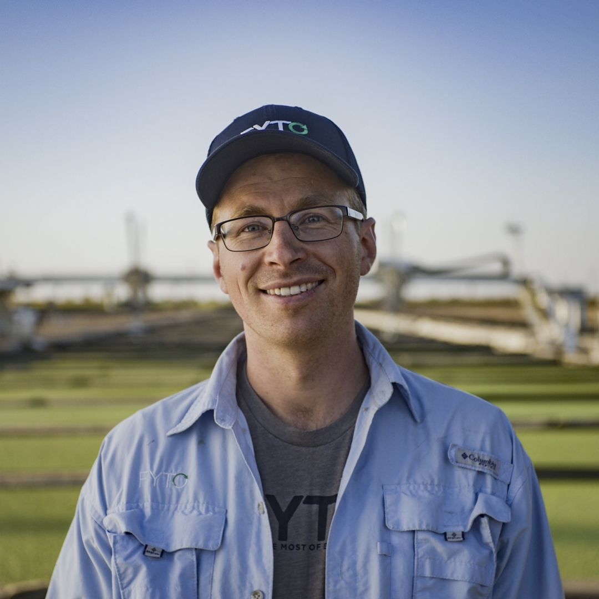
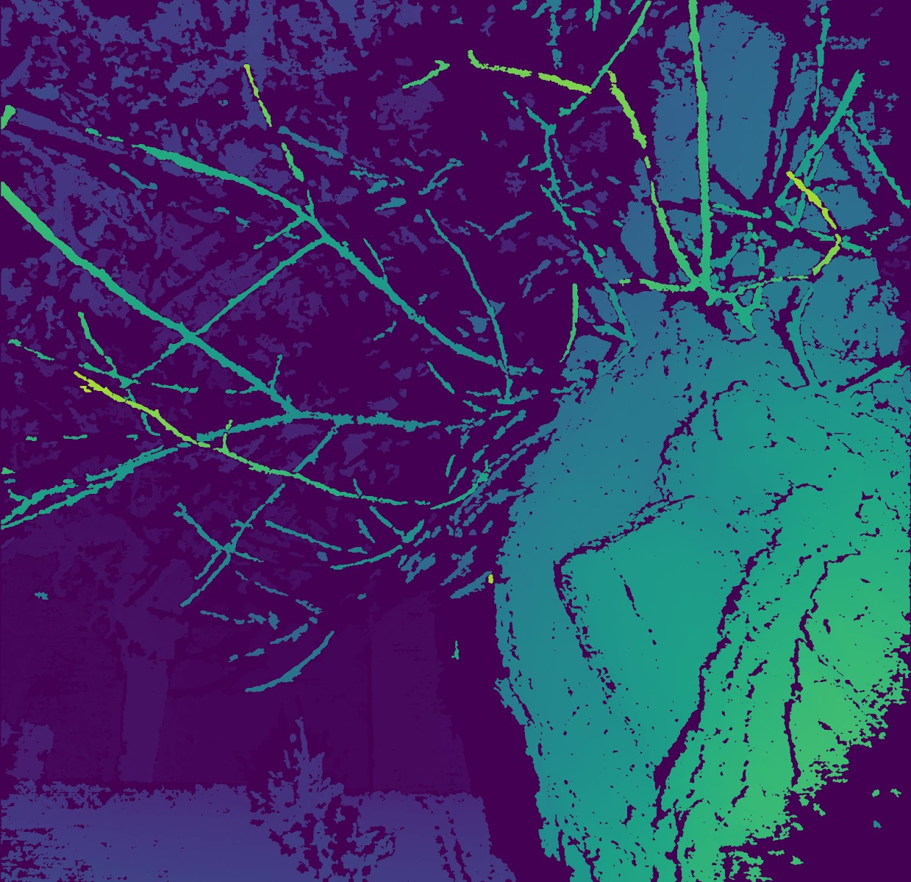
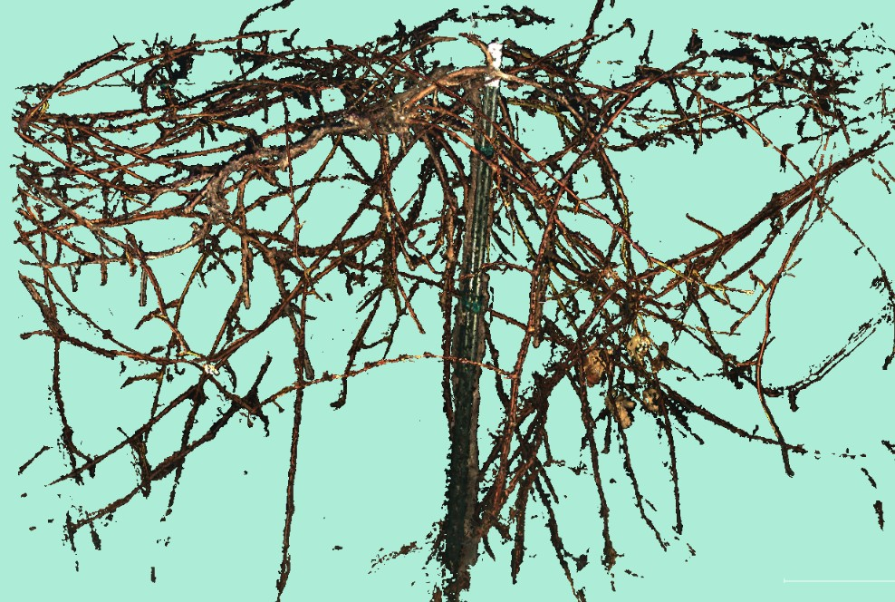
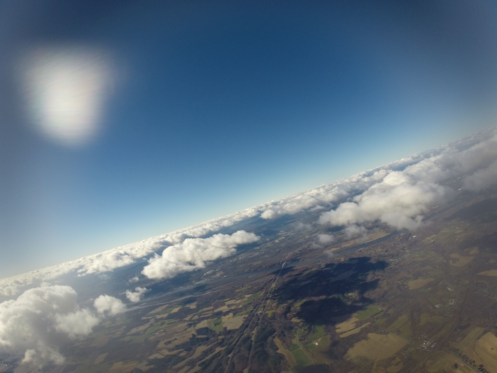

<!-- TODO: Update my resume! -->

{: .img-left-180w}

I am a master's student at the [Robotics Institute](https://www.ri.cmu.edu/) at Carnegie Mellon University (CMU MSR). I am working in the [Field Robotics Center](https://frc.ri.cmu.edu/) with [George Kantor](https://www.ri.cmu.edu/ri-faculty/george-a-kantor/) on agricultural robotics applications, focusing on outdoor imaging and reconstruction.

Previously I worked for six years at [RightHand Robotics](https://www.righthandrobotics.com/), a piece-picking robotics startup in the Boston area. It was a privilege to watch this startup grow up, and a great learning experience.

TODO: Mention interests.

---

#### Projects

A collection of some past projects that I had some documentation for, some serious and some for fun. Please get in touch if you'd like to know more.

<!-- TODO: Go through HDD and update all these with more pictures! -->

{: .img-left-80h}

[Flash Stereo](pages/flash-noflash.html)

&nbsp;

&nbsp;

{: .img-left-80h}

[Skeletonization](pages/skeletonization.html)

&nbsp;

&nbsp;

{: .img-left-80h}

[RightHand](pages/righthand.html)

&nbsp;

&nbsp;

<!-- Draft 1 done -->
{: .img-left-80h}

[Weather Balloon](pages/weather-balloon.html)

&nbsp;

&nbsp;

{: .img-left-80h}

[Air Maze](pages/airmaze.html)

&nbsp;

&nbsp;

{: .img-left-80h}

[NASA Sample Challenge](pages/nasa-challenge.html)

&nbsp;

&nbsp;

{: .img-left-80h}

[Sailbot](pages/sailbot.html)

&nbsp;

&nbsp;

{: .img-left-80h}

[Quadcopter Control](pages/quadcopters.html)

&nbsp;

&nbsp;

{: .img-left-80h}

[Barrett Technology](pages/barrett.html)

&nbsp;

&nbsp;

{: .img-left-80h}

[Magnetic Levitation](pages/maglev.html)

&nbsp;

&nbsp;

{: .img-left-80h}

[Harvest Automation](pages/harvest.html)

&nbsp;

&nbsp;

#### Other Interests

Fire arts, soccer, music.

---

<!-- TODO: Make smaller and right-justified? -->
&copy; Eric Schneider 2022, inspired by [1](https://github.com/kbroman/simple_site) [2](https://shivamduggal4.github.io/)