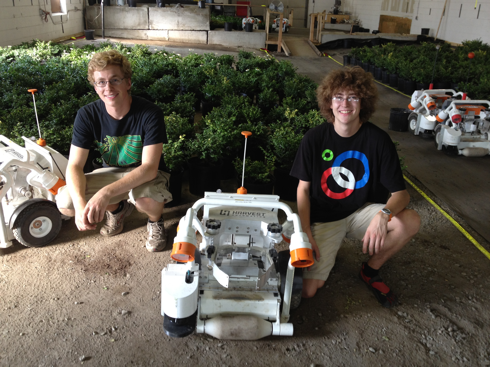

<!-- TODO: Update my resume! -->

{: .img-left-180w}

I am a master's student at the [Robotics Institute](https://www.ri.cmu.edu/) at Carnegie Mellon University (CMU MSR). I am working in the [Field Robotics Center](https://frc.ri.cmu.edu/) with [George Kantor](https://www.ri.cmu.edu/ri-faculty/george-a-kantor/) on agricultural robotics applications, focusing on outdoor imaging and reconstruction.

Previously I worked for six years at [RightHand Robotics](https://www.righthandrobotics.com/), a piece-picking robotics startup in the Boston area. It was a privilege to watch this startup grow up, as well as a great learning experience.

I'm interested in making useful work happen with computer vision. I feel like every robotics project has to start with perception, and all of the downstream actions and decisions rely on good decisions in that initial assessment of the world. While at CMU I'm doing my best to dive into imaging, machine learning for image processing, and 3D reconstruction.

---

#### Projects

Here is a collection of past projects that I had documentation for, some serious and some fun.

| | |
| --- | --- |
| {: .img-left-80h}                  | [Fyto](pages/fyto.html)                              Worked at this sustainable agriculture robotics company for two years |
| {: .img-left-80h}   | [Skeletonization](pages/skeletonization.html)        Attempting to decompose stereo images of vines into skeletal models |
| {: .img-left-80h}           | [Flash Stereo](pages/flash-noflash.html)             Explored using both flash and no-flash images in outdoor scenes |
| {: .img-left-80h}      | [Florascope](pages/florascope.html)                  Idea for in-field high quality leaf images that was given some thought but not finished |
| {: .img-left-80h}          | [RightHand](pages/righthand.html)                    Worked at this piece-picking startup for six years, from Applications Engineer to a Senior Software Engineer |
| {: .img-left-80h}    | [Weather Balloon](pages/weather-balloon.html)        Launched weather balloons across Massachusetts for some cool GoPro footage |
| {: .img-left-80h}           | [Air Maze](pages/airmaze.html)                       Made a 3D maze game out of the Bernoulli effect |
| {: .img-left-80h} | [NASA Sample Challenge](pages/nasa-challenge.html)   Constructed a robot for a NASA rover challenge at WPI |
| {: .img-left-80h}            | [Sailbot](pages/sailbot.html)                        Worked on making 2m autonomous sailboats |
| {: .img-left-80h}   | [Quadcopter Control](pages/quadcopters.html)         Capstone project to land quadcopters on a target board |
| {: .img-left-80h} | [Magnetic Levitation](pages/maglev.html)             Made a device to electromagnetically levitate a nut |
| {: .img-left-80h} | [Barrett Technology](pages/barrett.html)             Mechanical intern at Barrett, which makes tendon-driven robotic arms |
| {: .img-left-80h} | [Harvest Automation](pages/harvest.html)             Quality engineering intern at Harvest, testing agricultural robots |

---

#### Interests

Other random interests include [running](pages/images/sehome_xc.jpg), [hiking](pages/images/hiking_2.jpg), [choir](pages/images/powerchords.jpg) (shout-out to [Revels](https://revels.org/)), [soccer](pages/images/soccer.jpg), and [fire arts](https://drive.google.com/file/d/16Lut_dGIvgzn5PNNoVQJHhjt5TUXKUw_/view?usp=sharing) (shout-out to [Wildfire](https://www.wildfireretreat.org/)).

One fun suggestion - if you use git and have access to any large repositories with many contributors, do yourself a favor and run `gource`, then sit back and enjoy. This is a wonderful tool.

---

&copy; Eric Schneider 2022, inspired by [1](https://github.com/kbroman/simple_site) [2](https://shivamduggal4.github.io/)
