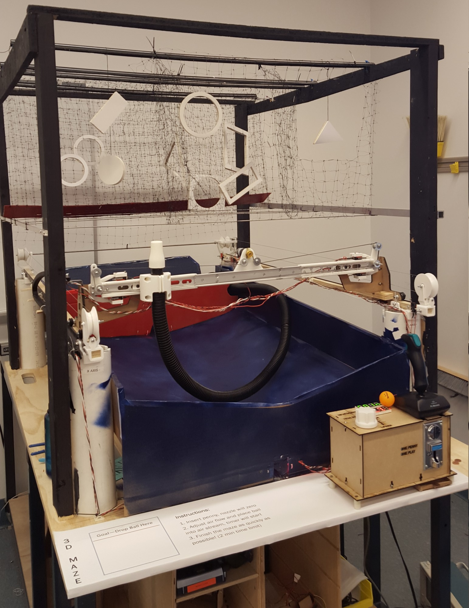
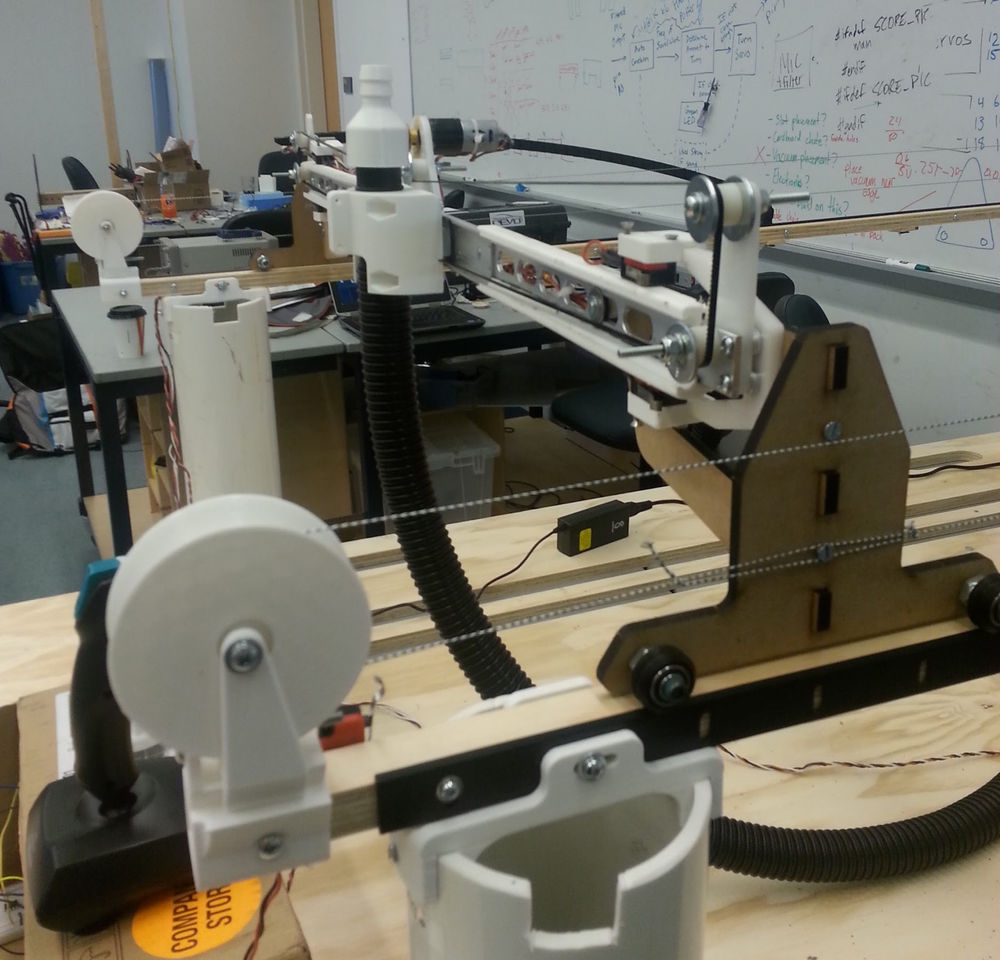
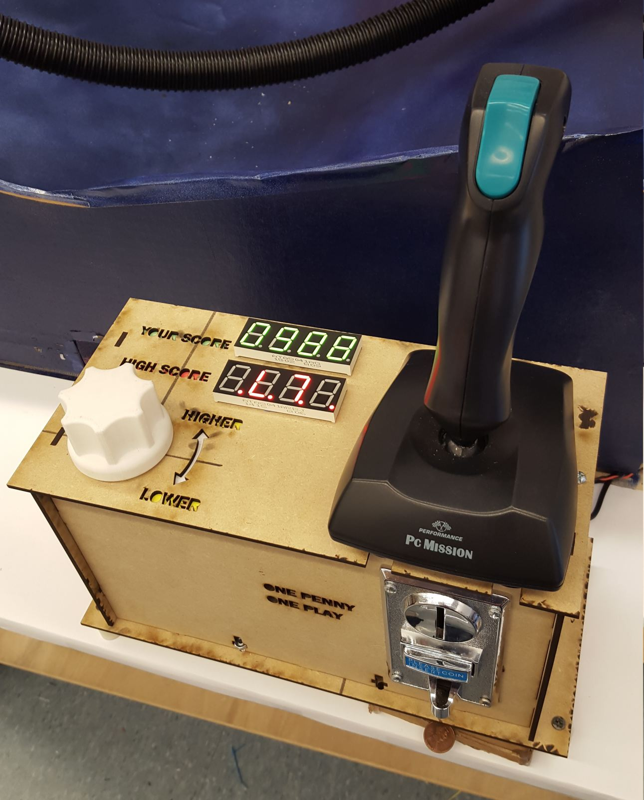
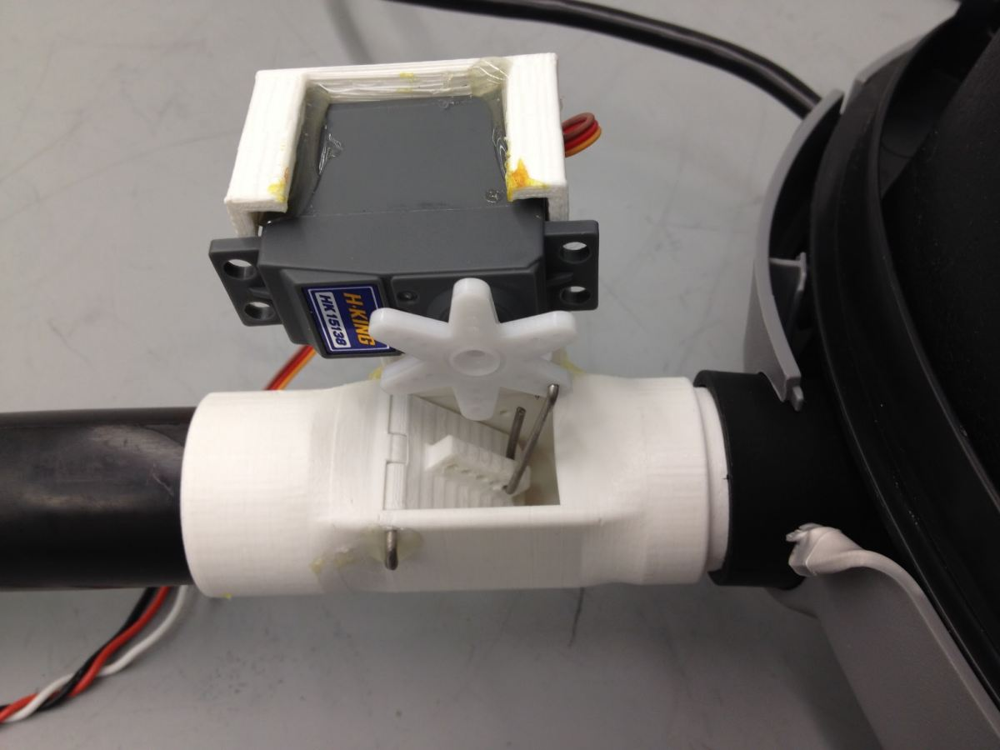
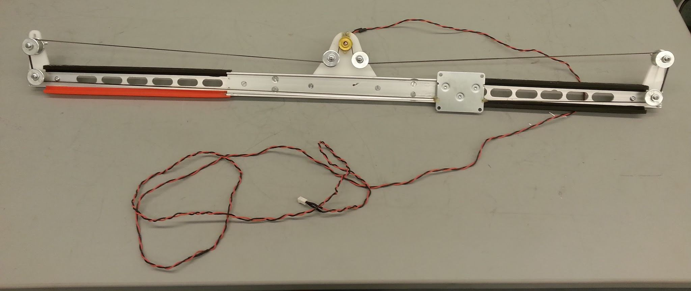

Senior year I worked with a team on a really fun project, where we used the Bernoulli effect to try and steer a ping-pong ball in 3D through a maze. We were on a tight budget for a device of this size, so we really had to push and polish to turn 3D printed railings and twine into a halfway serviceable XY gantry. One thing I learned is that although you can support a pingpong ball with the Bernoulli effect, the Z control is not particularly stable, especially when obstacles pass between the ball and the nozzle, so it can be frustrating to try to navigate obstacles... the idea could use some work. You can see it operate in [this video](https://www.youtube.com/watch?v=ECNAeCE4xNs).

One of our teammates made a [great website](http://elecanisms.olin.edu/2015/amazed/index.html) for this project (not a skill of mine), so as long as it stays hosted please peruse the site for more information. I think it's really well done for an end-of-semester project site.

One last thing. One of our professors for this course was [Aaron Hoover](https://amhoov.org/2021/01/03/remembering-aaron-hoover/), who sadly passed away in 2020. Going back through the project website I unexpectedly came across a (brief) video of him [using our system](https://www.youtube.com/watch?v=NmMez_tKlYo), which brought a lump to my throat. Aaron was great and he is missed.

&nbsp;

{: .img-tall}

{: .img-mid}

{: .img-mid}

{: .img-mid}

{: .img-mid}

{: .img-mid}