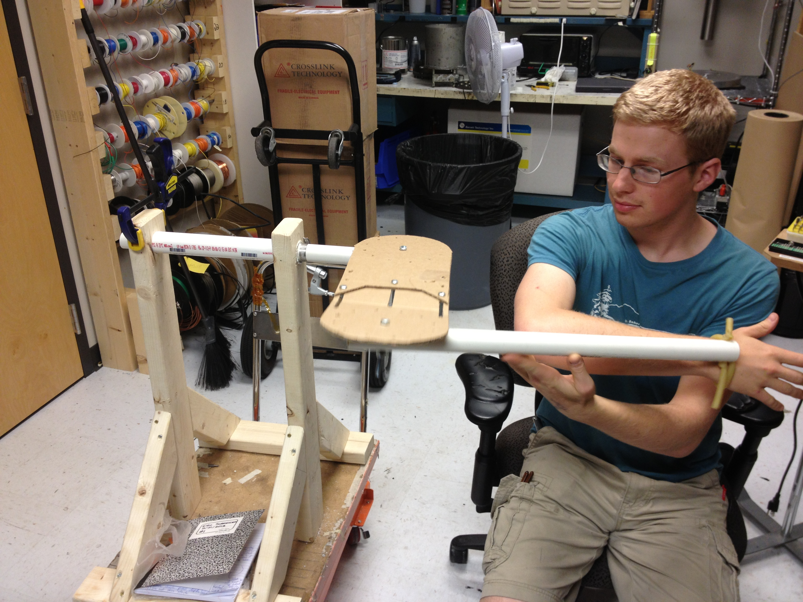
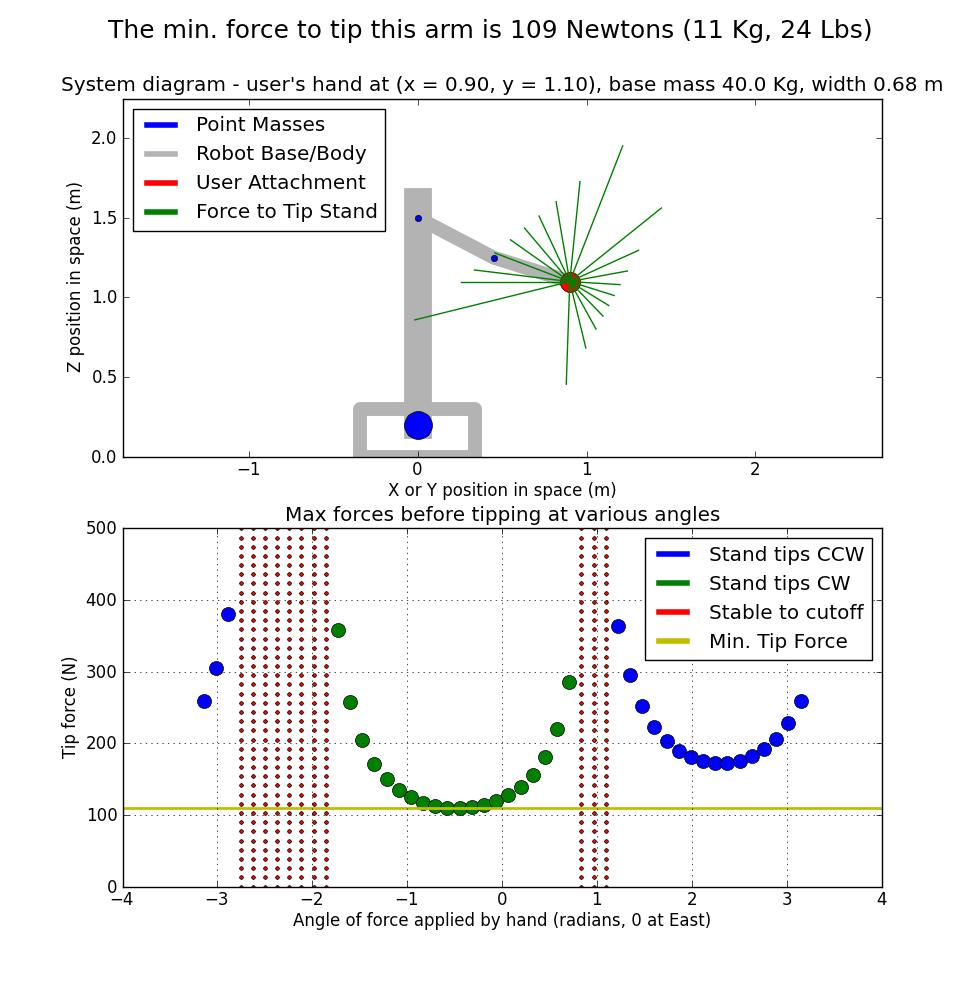
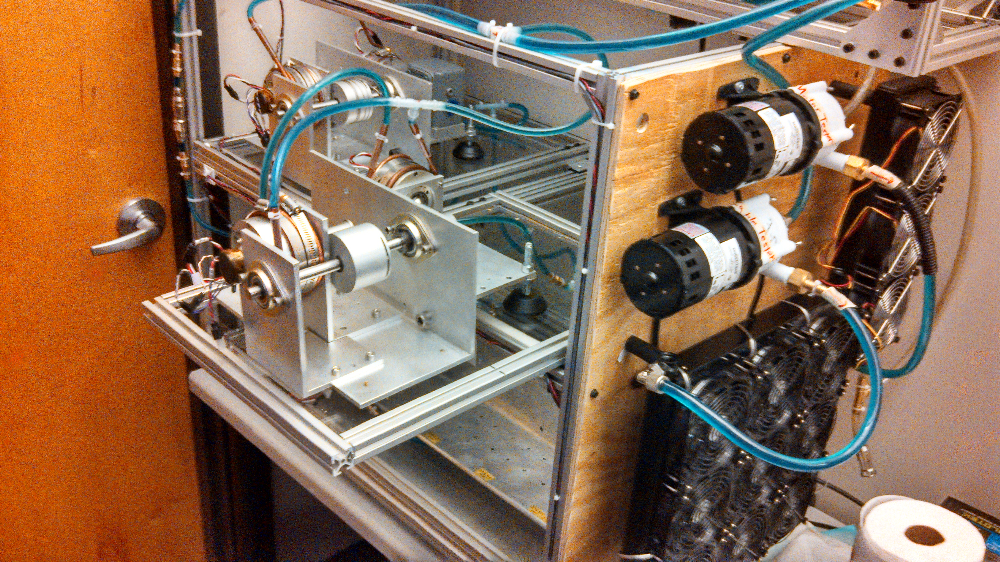
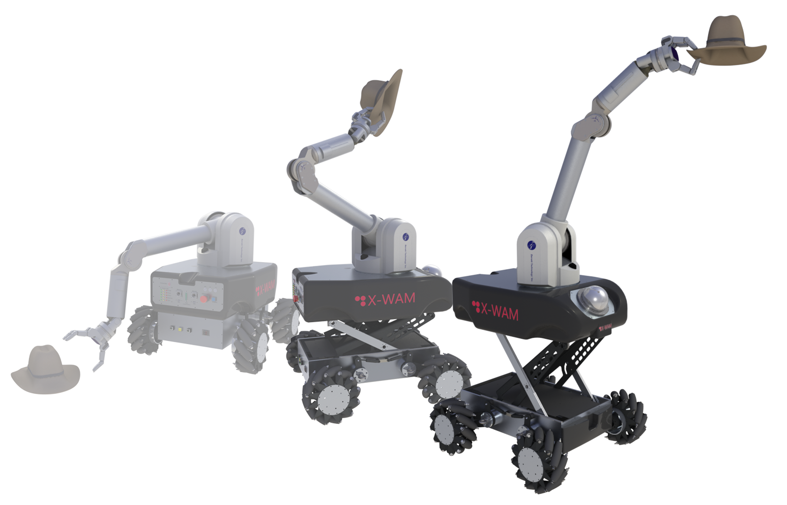

Sophomore summer I was lucky enough to be a mechanical engineering intern at Barrett Tech, a robotics company around Boston. One of the things we worked on were some very early mockups for what now appears to be the [Barrett Burt system](https://medical.barrett.com/burt), which is pretty darn cool. As you can tell from the images, in the very early prototypes we made the links adjustable length. The goal was to make a physical mockup that could change size so engineers could experiment and find good link lengths for therapy. This was a fun and educational job, there were good chances to think about how you could best help a project make progress with open ended goals like "build a kinematic mockup". I ran into Barrett again at ICRA 2022 and had fun saying hi and seeing Burt in action.

&nbsp;

{: .img-mid}

{: .img-mid}

{: .img-tall}

{: .img-mid}

{: .img-mid}
