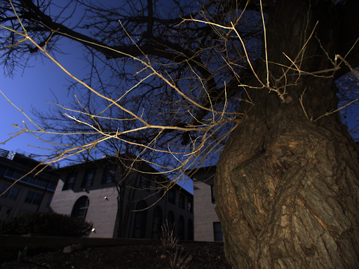
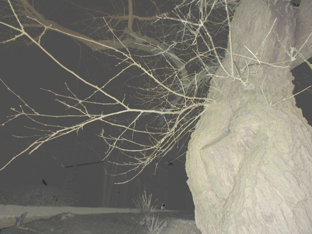
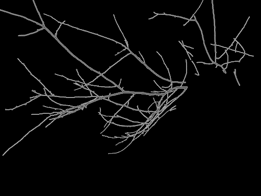
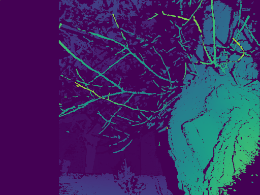

As part of a [physics-based vision](https://www.cs.cmu.edu/~motoole2/16823-s20/) class, I did a project testing some applications for combining flash images with no-flash images. Our lab makes illumination invariant cameras for outdoor use that are based on an extremely bright and fast flash, so I took some outdoor images with and without the flash on. Some images have the sun in the background and some do not, but they are all in bright daylight. I was trying to see whether the combination of flash/no-flash data would improve stereo data and it mostly wasn't promising, but there was a positive development right at the end where the use of flash/no-flash subtraction leads to simpler scenes, which seemingly makes stereo perform better in cluttered.

It got slightly mangled by the presention &rArr; PDF process, but [here is a presentation](https://drive.google.com/file/d/1A-eUeogmrIn6qDxaHbjUHMXTTsmLqjK6/view?usp=sharing) walking through some findings with flash/no-flash stereo images in outdoor settings.

{: .img-mid}

{: .img-mid}

{: .img-mid}

{: .img-mid}

{: .img-mid}

&nbsp;