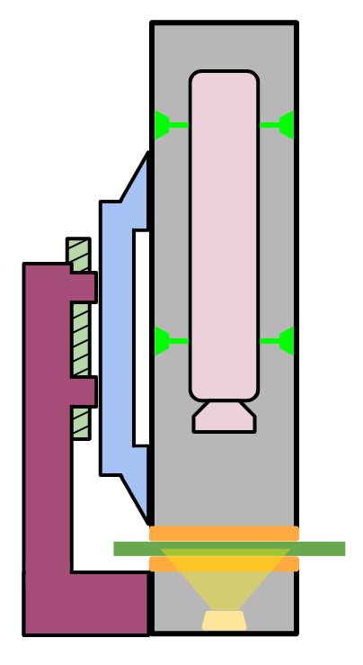

In my own time at the Kantor Lab at CMU I got really interested in the idea of an end effector that could easily snap onto leaves in the field and take well lit, well focused, high quality images to detect disease and stress. I started to think through the idea to present to the lab and took some test shots (in presentations below). I also started building a multispectral prototype, where different wavelengths of LED would backlight the leaf for multiple images, but at that point I was wrapping up my masters and ended up dropping the project. I don't have documentation for the multispectral version unfortunately.

For more information you can check out the [presentation I compiled for the lab](https://docs.google.com/presentation/d/1rgAeqe-MYEeuUqLWPm1o9VE1yY89CrrH0nV-3s81jJg/edit?slide=id.g13c311762f7_0_0#slide=id.g13c311762f7_0_0), as well as a [deep dive I did into prior work and possible opportunity areas](https://drive.google.com/file/d/1tQh1M8LSS-Id6fm1ii_aGi3wkDU2gWUD/view?usp=sharing). The deep dive presentation is a little clunky as a video, I suggest stopping on each page you want to read.

&nbsp;

{: .img-mid}

{: .img-mid}
