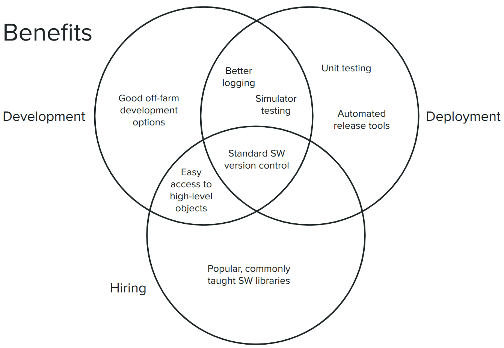
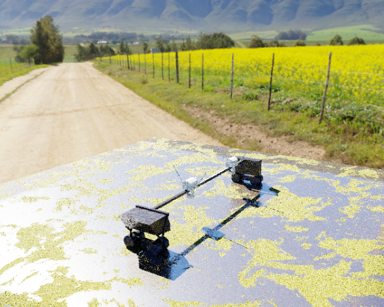

[Fyto](https://www.fyto.us/) was a really exciting place to work. I was inspired by Fyto’s mission to harvest a new [high protein feed crop](https://en.wikipedia.org/wiki/Lemna) that uses less land, water, and energy than traditional crops like soy and alfalfa. It was eye-opening to work on crop harvesting robots of that scale, the latest generation bot was over 140 feet long and safety was an important consideration. Although much of my work at Fyto can’t be shared publicly, here are some highlights from my time there.

For a good overview of the company, see [this promo video](https://vimeo.com/user127427797/review/1007273479/5602617d1c) and [demo day clips](https://vimeo.com/user127427797/review/1012452446/10df410020).

---

One big challenge between our Gen 3 and Gen 4 bots was the software architecture. We had been using an industrial controller for all bot logic, and that system posed a challenge to development best practices. There were a number of pain points:

* Version control not git-based and was very challengingresulting in a separate repository for each bot. This created significant challenges branching, and merging, and getting the code synced across different bots
* Simulated testing and unit testing were not possible, all testing had to happen in the field
* The controller’s programming language lacked support for basic structures like classes, dictionaries, and arrays, complicating even simple development goals

Summer of 2024 I ended up pitching a hybrid system to the team, where that same industrial controller would handle low-level control, safety, and I/O, and a Linux-based computer would handle higher-level autonomy tasks like motion planning and communication.

{: .img-mid}

Once the approach was green-lit, I built the system from the ground up over Winter 2024. It was a really good learning experience, and getting the chance to start from scratch meant I could bake in a lot of the development practices I find important. The system ended up being built in Docker containers, with a separate simulation container to mock out the hardware controller and allow for at-home full system testing. The state machine was complex, so both simulation testing and unit testing were extremely useful during development. I also got to try github integrations to run unit tests on each commit, which was a first for me.

{: .img-short}

---

One fun project was creating a pipeline for rendered plant images, then using those rendered images for machine learning. I worked with on online artist to get a simulated pond model, then did renderings in a wide variety of environments. This was a real win for model training! A pixel-wise image segmentation model was trained on 12,000 rendered images with a variety of simulated lighting conditions, and then fine tuned on only 74 real-world images. The real-world images were not close to being fully labeled in a pixel-wise fashion, but instead had on average 0.04% of pixels labeled. Due to the scarcity of labeled real-world data, training solely on real images wasn’t feasible. A render/train/finetune approach got the segmenter up to 92-98% accuracy on the (admittedly small) test set.

{: .img-short}

Rendered plant images:
{: .img-short}

Real plant images:
{: .img-short}

---

One project that I wish I got to push further than I did was multispectral crop health mapping. I ended up getting a commercial UAV pilot's license, verifying our drone's multispectral mapping capabilities, and started the process of regular on-site flights paired with plant health data collection efforts. I didn't get a chance to build up a full growing season dataset and analyze it, however, which would have been neat. I found the [Mavic 3M](https://ag.dji.com/mavic-3-m) to be a great multispectral drone, very smooth to operate.

{: .img-short}

---

The center is a fun image we noticed where the bot caught a reflection of itself in the water below, it reminded us of these other iconic shots.

{: .img-short}
