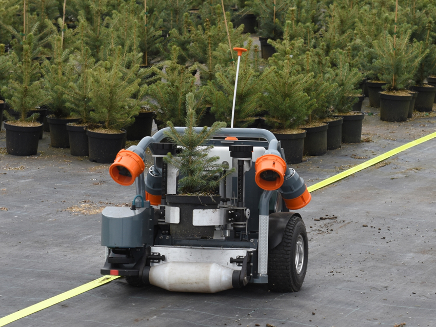
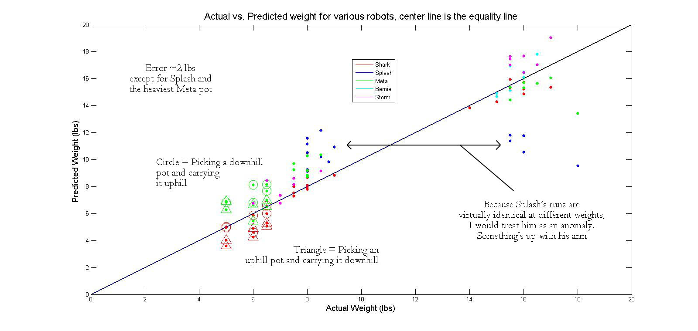

Freshman summer I was lucky enough to be a quality intern at Harvest Automation, where we spent our time running their nursery bots back and forth in test runs. It was good to see how features would be introduced, tested in simulation, and then finally tested by us in faux production. Our most analytical task was trying to figure out if there were any measured variables that could inform the robot about the weight of the picked pot. It ended up looking (unsurprisingly, really) like there was a pretty good relationship between arm amperage and pot weight. Since that time I believe the company has pivoted to spend some of their effort on warehouse goods handling, but the nursery robots do appear to still be available which is fun.

&nbsp;

{: .img-mid}

{: .img-mid}

{: .img-mid}
