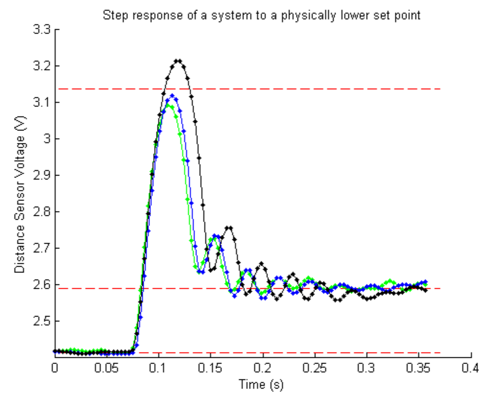

Senior year I did a controls final project where we levitated a nut underneath an electromagnet using a photoresistor, pretty simple except for some fiddly execution details. I remember really loving how controls theory can inform real-world phenomena, but haven't had a chance to dig into it in a formal way since. A video of the system [can be seen here](https://drive.google.com/file/d/1M-2vR3sw-KqP8lo-bjDXuIUmt4DpclDG/view?usp=sharing). For more information you can check out the [our final report](https://drive.google.com/file/d/169t7zPoueo4Jg8iOLpeT8sMgp2Yl09yI/view?usp=sharing), which my goodness have I forgotten a lot about.

&nbsp;

{: .img-mid}

{: .img-mid}
