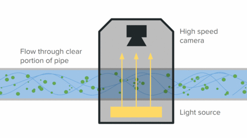
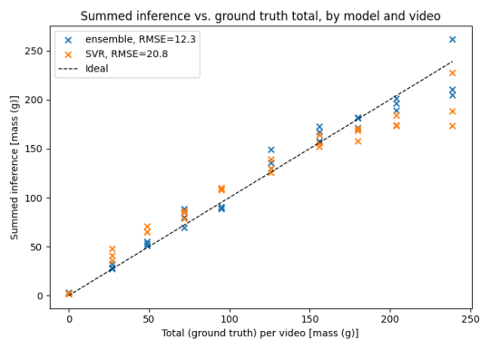

There was an idea I wanted to investigate - an internally lit inspection box, where the mass flow of objects passing through a pipe could be calculated using backlit video. At [my previous job](pages/fyto.html) we were harvesting waterborne plants by pumping plants and water along a pipe, and it would have been valuable to get a real-time estimate of harvested biomass. Eventually these videos could also support additional analyses, such as assessing plant health, detecting debris or pests, and monitoring water quality. This project tests the hypothesis that a backlit video could be used to estimate biomass flow with reasonable accuracy.

I wrote this project up in the [project github page](https://github.com/FranzEricSchneider/flow_videos/blob/main/README.md), so instead of recreating the report here, just go read that!

There's an [accompanying slideshow](https://docs.google.com/presentation/d/1c1pRzYdqQnm1N_qd-dYQaPG8VoMrDPT5KWU83HVyGdI/edit?slide=id.p#slide=id.p) as well with more details and images.

---

Idea:

{: .img-mid}

Example data:

{: .img-mid}

Example results:

{: .img-mid}