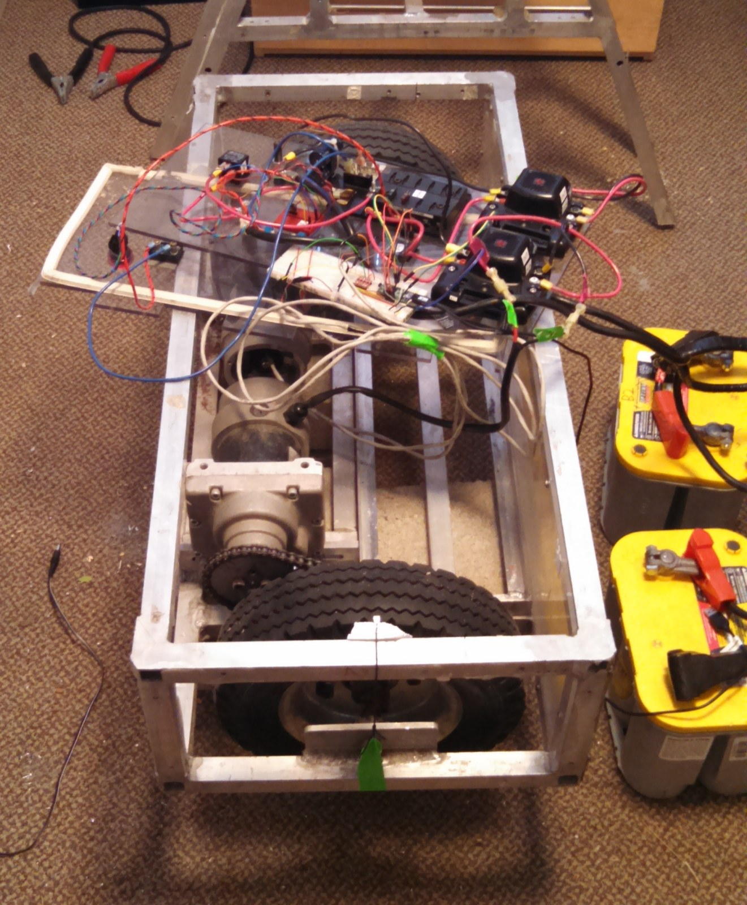
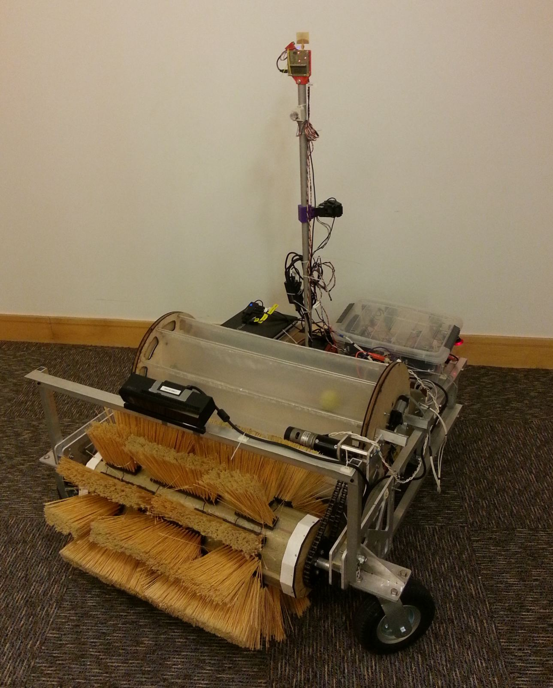
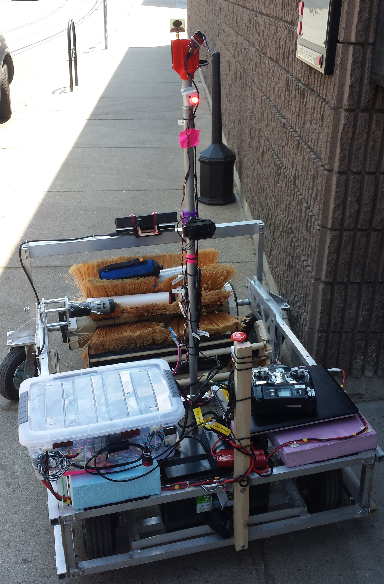
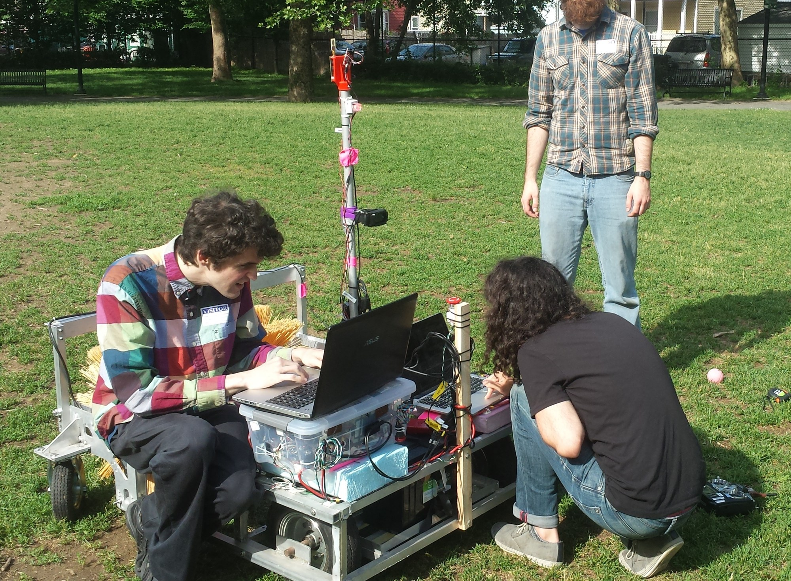

Senior year I got a chance to participate in a robot-build for a NASA rover challenge. This thing was really built on a college shoe-string, and had a series of kludged parts like a scavenged drive-train, plywood parts, tape/zipties, and tupperware electronics enclosures. It didn't end up working that well, but taught me a couple of things. First off, even relatively simple systems like a mobile base with a single end-effector can get complex electrically, with all the systems to power the computers, the motors, respond to remote controls, have safety fuses, etc. The basics can be annoyingly hard to get right. Second, I learned that in most robotics projects you really need solid hardware but after that's in place you need more software help than you'd expect. Our software team of two people was stretched too thin trying to cover the roles of systems integration, infrastructure, perception, localization, and then high-level planning on top of all that. All that said, it was a good project to work on and a privilege to work with the team.

There are some press release pages from NASA leading up to the event [here](https://www.nasa.gov/press-release/robotics-teams-prepare-to-compete-for-15-million-in-nasa-challenge)/[here](https://www.nasa.gov/directorates/spacetech/centennial_challenges/sample_return_robot/teams-compete-for-15-million-in-2016-sample-return-robot-competition.html)/[here](https://www.nasa.gov/press-release/nasa-holds-final-sample-return-robot-competition) and some random competition pictures I found [here](https://www.alamy.com/stock-photo-sample-return-robot-challenge-judges-look-at-the-mind-amp-iron-team-129870475.html).

&nbsp;

{: .img-mid}

{: .img-mid}

{: .img-tall}

{: .img-mid}

{: .img-mid}