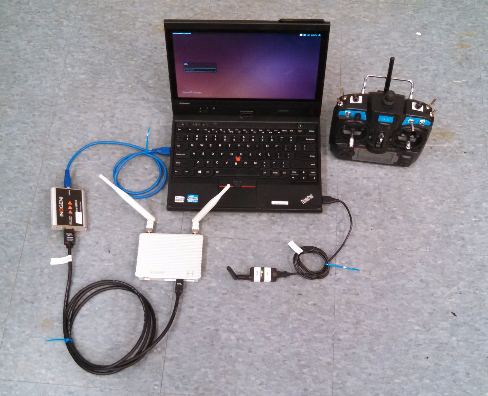
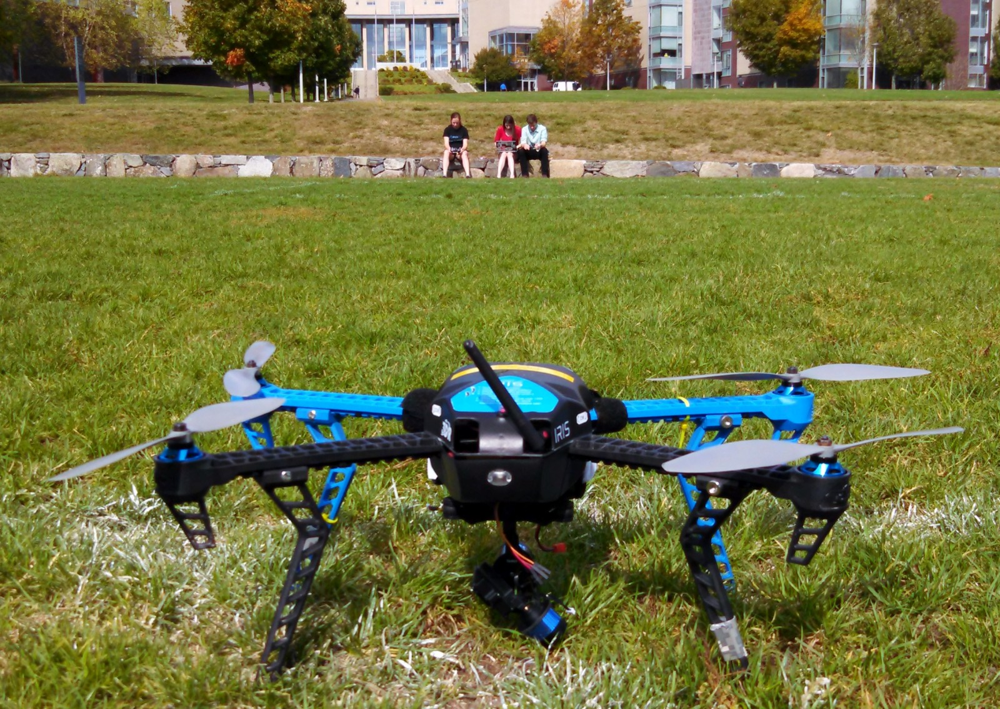

For my senior capstone project in college I worked with a team on landing an early 3D Robotics quadcopter on a landing pad. We struggled to figure out how to control it effectively, and were also hampered by the need for outdoor testing during a Boston winter. The quadcopter may or may not have started ignoring commands and headed straight up and out of sight at one point, only to be found a day later in a tree. Commercial quadcopters have come a long way, it's pretty great to see how much easier the stuff we struggled with is now. Definitely learned a lot on this project about the need for safe and reliable test methods during development.

For more information you can check out the [the archival project page](https://www.olin.edu/research/2014-15/Army%20Research%20Laboratory) or [the project poster](https://www.olin.edu/sites/default/files/arl_archival_poster.pdf)

{: .img-mid}

{: .img-mid}

{: .img-mid}

{: .img-mid}