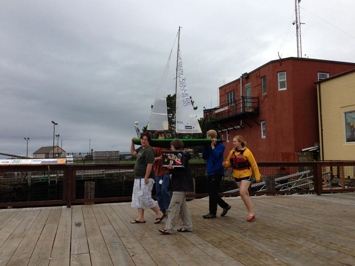

In college I got the chance to work on a project where we tried to make a robotic sailboat for competitions. I've got mixed feelings about this because I got to work with wonderful teammates, we worked really hard and learned a ton about everything from carbon fiber layup to anemometers, but also the systems never really worked as well as hoped. This project really hammered home both the necessity of copious systems testing and the challenges of systems testing when your vehicle needs extensive setup in particular conditions. It's my considered engineering opinion that anything having to do with water makes engineering a lot harder :) Props to those who actually make surface and underwater systems work.

Here you can find a [video of one of our boats](https://drive.google.com/file/d/1oxhEpL4SIg-h_7HudPzJT1x5eyEvdFxc/view?usp=sharing) futzing around under RC control in Lake Waban.

&nbsp;

{: .img-mid}

{: .img-mid}

{: .img-mid}

{: .img-mid}

{: .img-mid}

{: .img-mid}