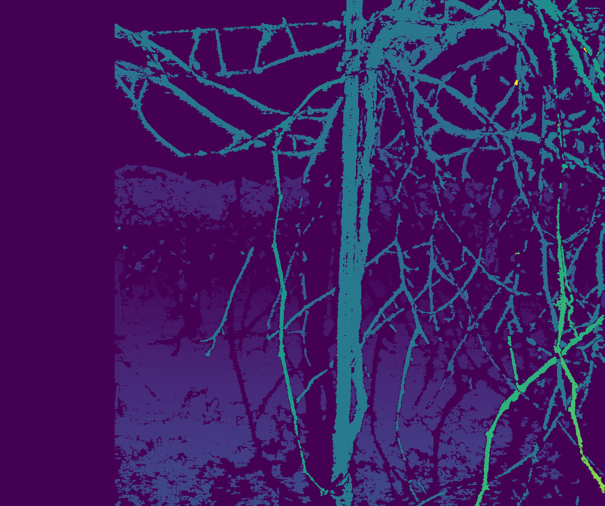
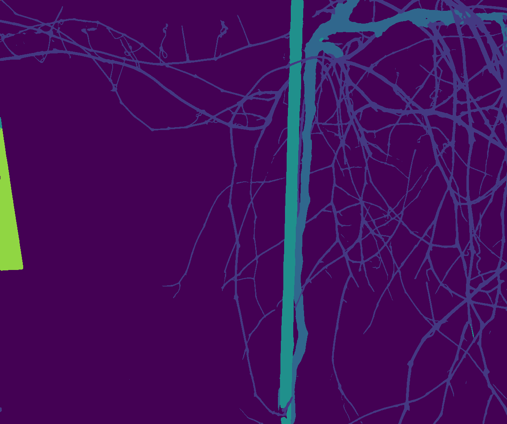
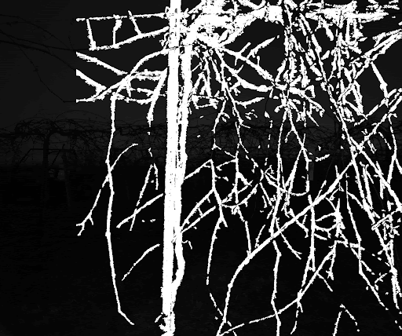
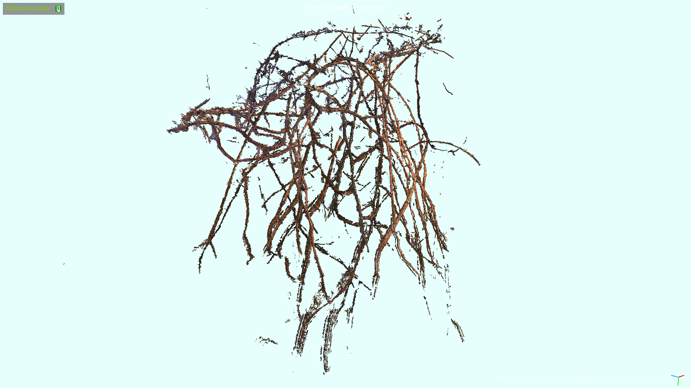

For research I have been trying to extract a skeletal model of grapevines from a series of stereo images, taken in the winter when grapes and leaves have fallen off. The vine structures are extremely complex, with many criss-crossing branches. The basic approach is to get stereo data, filter it with semantic segmentation of the vines, combine multiple views into a single point cloud, and then reason about the presence and position of vines in the image. This is still a work in progress, but below you can see parts of the process with the vine disparity, semantic segmentation, and a multi-view point cloud.

As preparation I looked into a variety of papers about methods for getting tree skeletons out of point cloud data. [See presentation for a review.](https://docs.google.com/presentation/d/14o7zR0qaQ0y23H6QyPa4haUFUkADsynxajKqJikayDM/edit#slide=id.g11ba94065d7_0_0)

&nbsp;

{: .img-mid}

{: .img-mid}

{: .img-mid}

{: .img-mid}

{: .img-mid}
