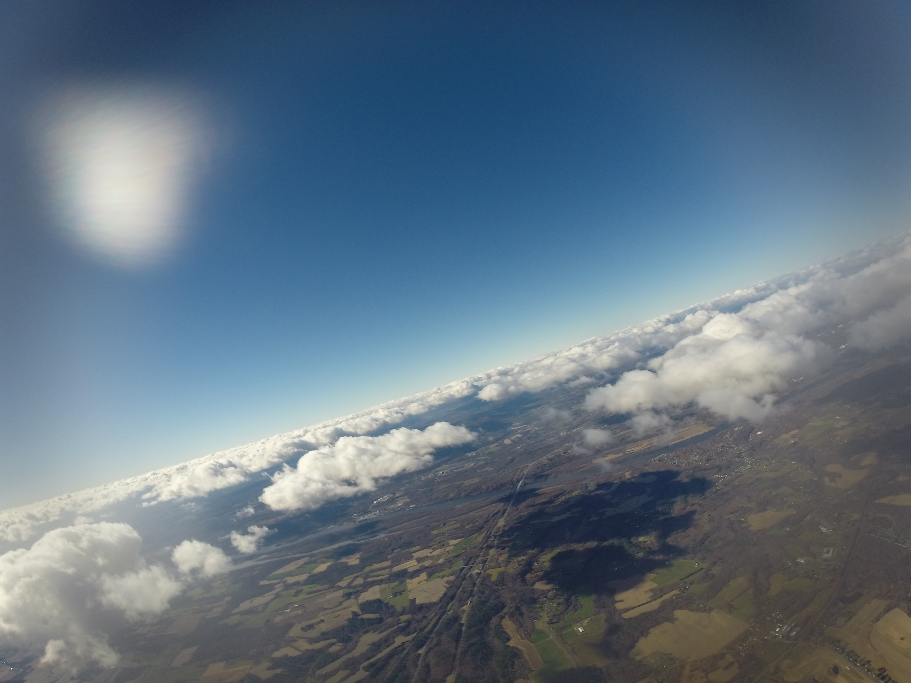

In college a friend wanted to do a weather balloon project for fun and take some high-altitude images, so we gave it a go! We designed a foam enclosure with fins for stabilization, several cameras, GPS tracking, a parachute, and a little homemade gimbal system in a hamster ball to keep the GPS pointed skywards. We did multiple launches from western Massachusetts that all ended up in trees, and got some really great sky and cloud pictures. Later I randomly did a little consulting about weather balloon launches for a company that wanted to get a marketing video, that was fun.

&nbsp;

{: .img-mid}

{: .img-mid}

{: .img-mid}

{: .img-mid}

{: .img-mid}

{: .img-tall}